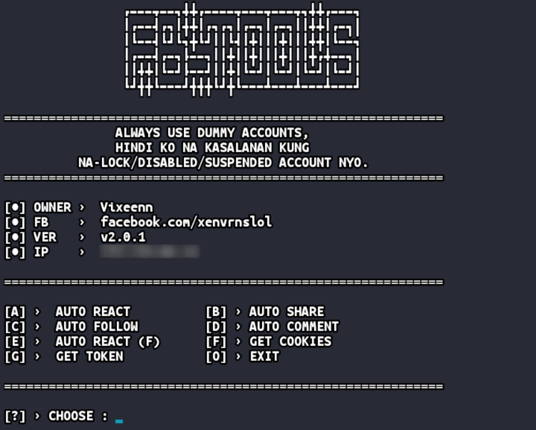

<p align="center">
A simple Facebook Tool using termux & python language made by me.
</p>
</a>

### HI USER !

<h4>Hello there User! thank you for using my tool :))</h4>

> [!NOTE]
> - If you encounter any issues or difficulties, don't hesitate to reach out and ask for assistance here. I’m here to help you with any problems you may face.

```python
git clone https://github.com/defujye/fb-tools.git
```
```python
cd fb-tools
```
```python
pip install -r requirements.txt
```
```python
python tools.py
```

### AUTO SHARE (NOTE & TUT)

<details>
<summary>Auto Share</summary>

  - Auto Share is a feature that automatically shares post BUT, the privacy is private. if you use this tool, you account doesn’t have shares on your timeline. it’s like the post you’re sharing disappeared haha lol.
  - By using this feature, i am not responsible for any misuse and illegal activities.
  - If you don’t know how to use it, simply type “B” in your termux and fill in the needed info like email and password, also the link, delay seconds, limit of shares. i recommend “1” for the delay seconds.

</details>

### AUTO REACT (NOTE & TUT)

<details>
<summary>Auto React</summary>

- Auto React is a feature that increases your reactions in your Facebook post.
- Again, by using this feature, i am not responsible for any misuse and illegal activities.
- How to use? simply type “A” in your keyboard and fill in the needed like access token, limit of reacts, and the reacts delay. i recommend “5” for the delay.

</details>

### AUTO FOLLOW (NOTE & TUT)

<details>
<summary>Auto Follow User</summary>

- Auto Follow User is a feature that automatically follows the facebook user by using pages and token.
- Again, by using this feature, i am not responsible for any misuse and illegal activities.
- How to use? first you’ll need an account that haves profile pages and then run the tool, we’ll need to get token first so if you need a token getter, type “G” in your termux and fill in the email and password.
- After that, the token will be generated, now that you’re in the menu. choose the “C” or Auto Follow User. put the token, Facebook profile URL, limit of followers (how many pages do you have), also the delay seconds. i recommend “3” for the delay seconds.

</details>

### AUTO REACT (NOTE & TUT)

<details>
<summary>Auto React (Flikers API)</summary>

- Auto React is a feature that increases your reactions in your Facebook post, it’s not arab based nor vm based. it’s PH based yk
- Again, by using this feature, i am not responsible for any misuse and illegal activities.
- How to use? first we’ll need to get cookies first, by getting cookies you need to go back in menu and type “F” to get cookies. fill in the email and password.
- After filling in the email and password, copy the generated cookies (we’ll need it later). now you back in menu and choose the “E” or Auto React.
- AVAILABLE REACTIONS : ❤️, 🤗, 😆, 😢, 😠, 👍
- Fill in the Facebook post URL, reaction type and the paste the cookies you copied earlier.

</details>

## GET COOKIES (NOTE & TUT)

<details>
<summary>Get Cookies</summary>

- Get Cookies is a feature that retrieves your cookies using email and password you put in the tool.
- Again, by using this feature, i am not responsible for any misuse and illegal activities.
- How to use? Just simply choose the “F” and entering your email and password.
- After filling in the email and password, wait 1-2 minutes and your cookies will be generated.

</details>

### GET TOKEN (NOTE & TUT)
<details>
<summary>Get Token</summary>

- Get Token is a feature that retrieves your cookies using your facebook account
- Again, by using this feature, i am not responsible for any misuse and illegal activities.
- How to use? Type “G” and enter your email and password.
- After entering your email and password, wait 1-2 minutes and your token will be generated.

</details>

### AUTO COMMENT (NOTE & TUT)

<details>
<summary>Auto Comment</summary>

- Auto Comment is a feature that automatically follows the facebook user by using pages and token.
- Again, by using this feature, i am not responsible for any misuse and illegal activities.
- How to use? first you’ll need an account that haves profile pages and then run the tool, we’ll need to get token first so if you need a token getter, type “G” in your termux and fill in the email and password.
- After that, the token will be generated, now that you’re in the menu. choose the “D” or Auto Comment. put the token, Facebook post URL, limit of comments (how many pages do you have), also the delay seconds. i recommend “5” for the delay seconds.

</details>
